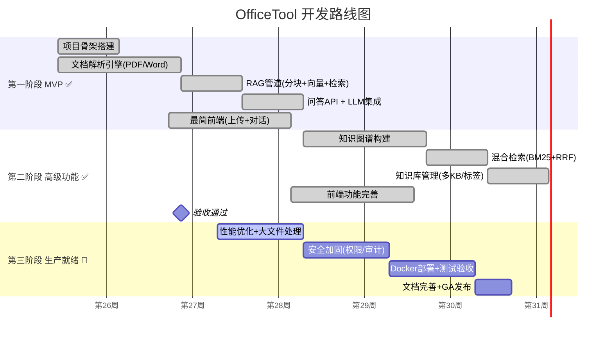

# OfficeTool 产品文档中心

> **项目名称**: OfficeTool — 企业级文档智能解析与问答系统
> **产品定位**: 私有部署的企业文档智能系统，LLM + RAG + 知识图谱
> **技术栈**: Python + FastAPI（后端） + React（前端）
> **文档版本**: v4.0 | 2026-07-11 | **当前阶段**: 第三阶段（瑶光）— 生产就绪

---

## 📚 文档导航

### 🚀 快速开始

如果你是新成员，建议按以下顺序阅读：

| 顺序 | 文档 | 阅读耗时 | 适用角色 |
|------|------|---------|---------|
| ① | [产品需求文档 (PRD)](./01-产品需求文档(PRD).md) | 30 分钟 | **全体成员** |
| ② | [系统架构设计](./02-系统架构设计.md) | 45 分钟 | 研发部 / 架构师 |
| ③ | [第一阶段-MVP详细规划](./03-第一阶段-MVP详细规划.md) | 20 分钟 | 研发部 / PM（历史参考） |
| ④ | [UI交互设计规范](./09-UI交互设计规范.md) | 20 分钟 | 研发部 / 设计师 |

---

## 📋 完整文档清单

### 产品与规划（全体必读）

| 文档 | 描述 | 文档 | 描述 |
|------|------|------|------|
| [📋 01-PRD](./01-产品需求文档(PRD).md) | 产品愿景、用户画像、功能优先级 | [📐 02-架构](./02-系统架构设计.md) | 系统架构、模块划分、技术选型 |
| [🎯 03-MVP规划](./03-第一阶段-MVP详细规划.md) | 第1月：核心链路跑通 ✅ | [⚡ 04-高级功能](./04-第二阶段-高级功能详细规划.md) | 第2月：KG + 混合检索 ✅ |
| [🔧 05-生产就绪](./05-第三阶段-生产就绪详细规划.md) | 第3月：性能 + 安全 + 部署 🔄 进行中 | | |

### 技术详设（研发部必读）

| 文档 | 描述 | 文档 | 描述 |
|------|------|------|------|
| [📄 06-解析引擎](./06-文档解析引擎设计.md) | 20+格式解析、OCR方案 | [🔍 07-RAG系统](./07-RAG与检索系统设计.md) | 分块、向量化、混合检索 |
| [🕸️ 08-知识图谱](./08-知识图谱与实体抽取设计.md) | 实体抽取、Neo4j、图谱检索 | | |

### 设计与运维

| 文档 | 描述 | 文档 | 描述 |
|------|------|------|------|
| [🎨 09-UI规范](./09-UI交互设计规范.md) | 页面布局、组件、交互流程 | [🚀 10-部署运维](./10-部署与运维方案.md) | Docker、硬件、安全、监控 |

---

## 🗺️ 项目路线图



---

## 🎯 系统功能全景

```
OfficeTool 企业级文档智能解析系统
│
├── 🤖 文档解析引擎
│   ├── PDF      → PyMuPDF / pdfplumber
│   ├── DOCX     → python-docx
│   ├── XLSX     → openpyxl
│   ├── PPTX     → python-pptx
│   ├── 图片OCR  → PaddleOCR / Tesseract
│   ├── TXT/MD/CSV/JSON/HTML/XML → 标准库
│   └── 输出统一格式: DocumentChunk
│
├── 🧠 RAG 检索增强生成
│   ├── 文本分块   → LangChain TextSplitter
│   ├── Embedding  → text2vec / bge-large-zh
│   ├── 向量存储   → Milvus / Qdrant
│   ├── BM25检索   → Elasticsearch
│   ├── 混合检索   → 向量 + BM25 + 图谱
│   └── RRF重排序  → Reciprocal Rank Fusion
│
├── 🕸️ 知识图谱
│   ├── 实体抽取   → LLM + 规则引擎
│   ├── 关系构建   → 三元组抽取
│   ├── 图谱存储   → Neo4j
│   └── 图谱查询   → Cypher + 自然语言
│
├── 💬 智能问答
│   ├── 对话管理   → 多轮对话上下文
│   ├── 答案溯源   → 引用原文 + 页码
│   ├── 置信度评估 → Answer confidence scoring
│   └── 多知识库   → 跨KB检索
│
├── 📚 知识库管理
│   ├── 多知识库   → 独立隔离的知识空间
│   ├── 标签系统   → 灵活分类
│   ├── 版本管理   → 文档版本追踪
│   └── 批量导入   → 文件夹/压缩包上传
│
└── 🔒 企业级特性
    ├── 权限控制   → RBAC 角色权限
    ├── 审计日志   → 操作全量记录
    ├── 数据加密   → 传输 + 存储加密
    └── 私有部署   → 全组件内网运行
```

---

## 🏢 部门与责任分工

> **组织架构 v4.0**（自 2026-07-11 生效）：项目团队精简为三大部门。

### 部门责任总表

| 部门 | 代号 | 核心职责 | 必读文档 | 关键产出物 |
|------|------|---------|---------|-----------|
| **产品部** | PM | 需求定义、优先级排序、阶段验收、文档管理 | 01, 03, 04, 05 | PRD + 验收报告 + Release Notes |
| **研发部** | R&D | 全部技术交付：后端/前端/AI/运维/部署 | 02, 06, 07, 08, 09, 10 | 全部代码 + 部署脚本 + 运维文档 |
| **测试部** | QA | 功能测试、性能压测、安全测试、兼容性测试、验收 | 01, 03, 04, 05 | 测试用例 + 测试报告 |

> **历史说明**: 第一、二阶段采用六部门架构（PM / BE / FE / AI / QA / Ops），自第三阶段起合并为三部门。历史阶段文档中的部门划分保留原文作为工作记录。

### 模块归属矩阵

| 系统模块 | 主责 | 说明 |
|---------|:--:|------|
| 文档解析引擎 (06) | **R&D** | 含 OCR、布局分析 |
| RAG检索管道 (07) | **R&D** | 向量库、ES集成、精排 |
| 知识图谱引擎 (08) | **R&D** | Neo4j + LLM抽取 |
| LLM网关 | **R&D** | API封装 + Prompt工程 |
| 知识库/文档CRUD | **R&D** | — |
| 问答编排服务 | **R&D** | SSE流式 + 多轮对话 |
| 用户认证/权限 | **R&D** | RBAC + 安全加固 |
| 前端全部页面 | **R&D** | React + 可视化 |
| Docker部署 | **R&D** | 生产编排 + 运维脚本 |
| 监控告警 | **R&D** | — |
| 备份恢复 | **R&D** | — |
| 需求/验收 | **PM** | 产品部整体把控 |
| 测试/质量 | **QA** | 测试部独立验证 |

### 各阶段部门投入

| 阶段 | PM | R&D | QA |
|------|:--:|:--:|:--:|
| Phase 1 MVP (W1-4) ✅ | 🟢 全程 | 🟢 全程 | 🟡 W4 |
| Phase 2 Beta (W5-8) ✅ | 🟢 全程 | 🟢 全程 | 🟢 W7-8 |
| Phase 3 GA (W9-12) 🔄 | 🟢 全程 | 🟢 全程 | 🟢 全程 |

> 🟢 全职投入 &nbsp; 🟡 兼职/按需参与

---

## 📐 版本历史

| 版本 | 日期 | 变更说明 |
|------|------|---------|
| v4.0 | 2026-07-11 | **组织架构调整**: 部门从六部门（PM/BE/FE/AI/QA/Ops）合并为三部门（PM/R&D/QA）；Phase 2 验收通过，进入 Phase 3 |
| v3.0 | 2026-06-27 | **重大转型**: 从Office桌面工具 → 企业级文档智能解析系统，LLM+RAG+KG |
| v1.0 | 2026-06-27 | 初版：Office文档桌面处理工具（已废弃） |

---

## 🔗 相关资源

- **LLM API文档**: 通义千问 / DeepSeek 官方文档
- **LangChain文档**: https://python.langchain.com
- **Milvus文档**: https://milvus.io/docs
- **Neo4j文档**: https://neo4j.com/docs

---

> 📝 本文档由产品部维护。任何架构或需求的重大变更，请同步更新对应的阶段规划与设计文档。
